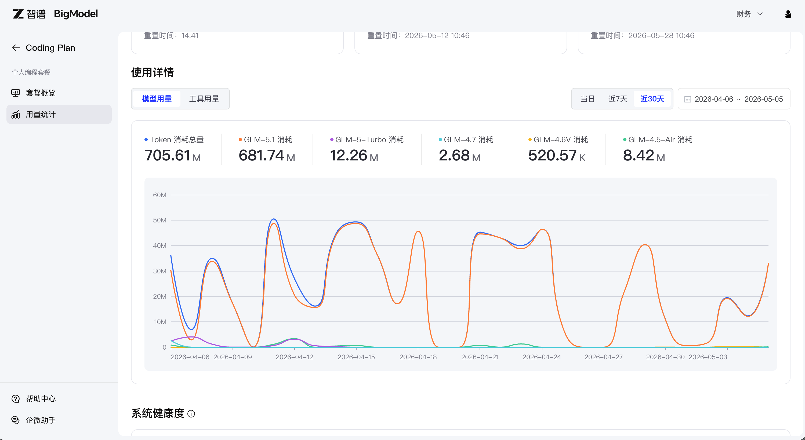
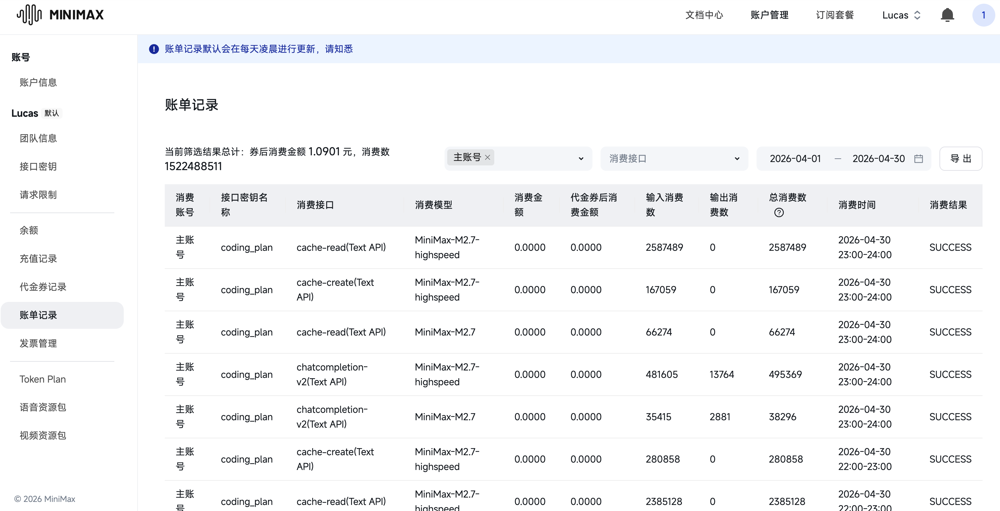
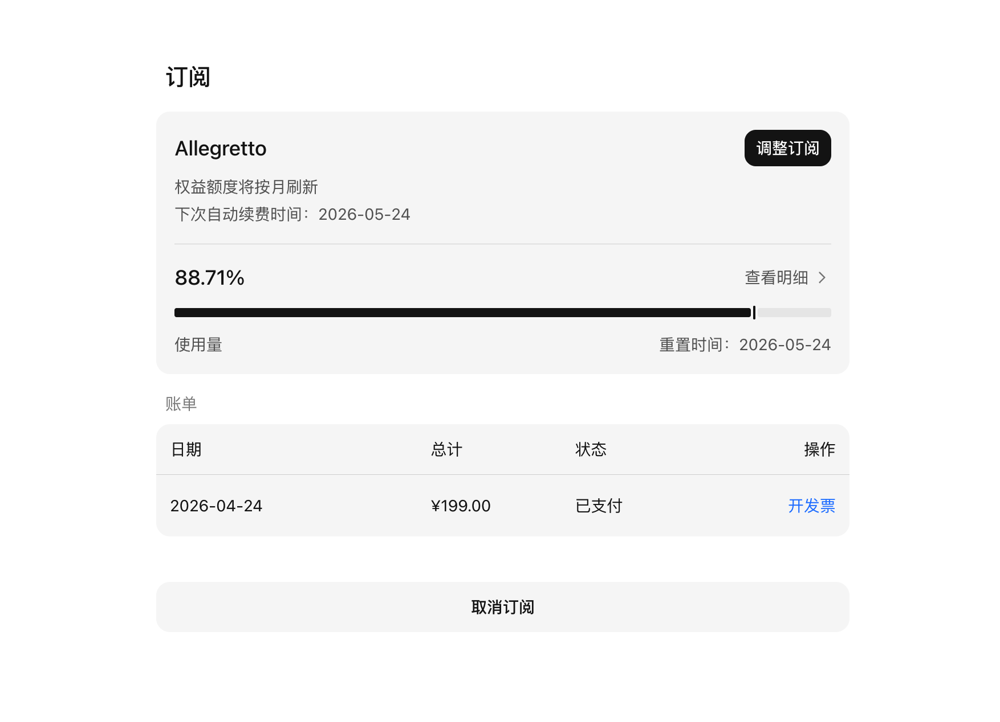
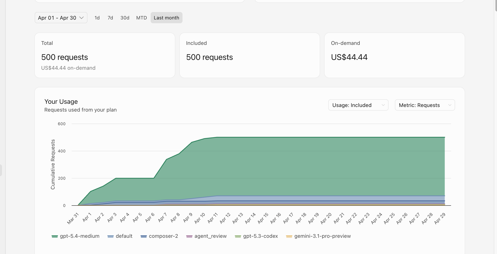

# 📊 LLM Token Consumption Statistics

## Overview

CortexInvest 是一个 **LLM 密集型应用**，基于真实生产数据，月均消耗约 **705M tokens**（智谱 GLM 平台数据）。本文档详细统计各模块的 Token 消耗情况，为 MiMo Token Plan 申请提供数据支撑。

### 历史用量证明（多平台）

#### 1. 智谱 AI 平台（累计）



| 模型 | 消耗量 | 占比 |
|------|--------|------|
| **GLM-5.1** | 681.74M | 96.6% |
| **GLM-5-Turbo** | 12.26M | 1.7% |
| **GLM-4.5-Air** | 8.42M | 1.2% |
| **GLM-4.7** | 2.68M | 0.4% |
| **GLM-4.6V** | 520.57K | 0.1% |
| **智谱总计** | **705.61M** | **100%** |

#### 2. MiniMax 平台（2026-04 月度）



| 模型 | 输入 Tokens | 输出 Tokens | 总消耗 | 占比 |
|------|-------------|-------------|--------|------|
| **MiniMax-M2.7** | 1,102.14M | 7.86M | **1,110.00M** | 72.9% |
| **MiniMax-M2.7-highspeed** | 407.87M | 3.01M | **410.88M** | 27.0% |
| **MiniMax-Text-01** | 0.78M | 0.04M | 0.81M | 0.1% |
| **MiniMax-M2.5** | 0.71M | 0.01M | 0.72M | 0.0% |
| **MiniMax 总计** | **1,511.57M** | **10.92M** | **1,522.49M** | **100%** |

#### 3. Moonshot Kimi 平台（2026-04-24 至今）



| 套餐 | 开通时间 | 价格 | 已用比例 | 状态 |
|------|----------|------|----------|------|
| **Kimi Code Allegretto** | 2026-04-24 | ¥199 | **88.71%** | ⚠️ 即将耗尽 |

> **关键发现**：
> - Kimi Code 套餐 12 天内消耗 88.71%，日均消耗约 **15%**
> - 下次自动续费：2026-05-24
> - 反映出代码生成和复杂推理任务的高频需求

#### 4. Cursor 平台（2026-04 月度）



| 指标 | 数值 |
|------|------|
| **时间范围** | Apr 01 - Apr 30 |
| **总请求数** | 500 requests |
| **按需消费** | US$44.44 |
| **包含请求数** | 500 requests |
| **使用模型** | gpt-5.4-medium, composer-2, agent_review, gpt-5.3-codex, gemini-3.1-pro-preview |

> **四平台合计**: 2,228.10M+ tokens + Kimi Code 高频使用 + Cursor 500 requests
> 
> 数据来源：
> - 智谱 AI 开放平台历史累计用量（截图：`img/zhipu.png`）
> - MiniMax 开放平台 2026-04 月度账单（截图：`img/minimax.png`）
> - Moonshot Kimi Code 套餐用量（截图：`img/kimi.png`）
> - Cursor 月度用量（截图：`img/cursorpng.png`）
> 
> 说明：本项目为**超重度 LLM 用户**，跨四平台月均消耗超 15 亿 tokens + 500+ requests

---

## Daily Token Consumption Breakdown

### By Feature Module

| Module | Function | Tokens/Call | Calls/Day | Daily Tokens | Monthly Tokens |
|--------|----------|-------------|-----------|--------------|----------------|
| **Daily Summary** | Post-market comprehensive analysis | ~50,000 | 1 | ~50,000 | ~1.5M |
| **Morning Briefing** | Pre-market briefing | ~30,000 | 1 | ~30,000 | ~900K |
| **Stock Analysis** | Individual stock deep analysis | ~20,000 | 5 | ~100,000 | ~3M |
| **Signal Interpretation** | Trading signal explanation | ~10,000 | 10 | ~100,000 | ~3M |
| **Risk Assessment** | Risk evaluation report | ~15,000 | 2 | ~30,000 | ~900K |
| **System Prompts** | Context maintenance | ~5,000 | 20 | ~100,000 | ~3M |
| **TOTAL** | | | **39** | **~410,000** | **~12.3M** |

### 实际生产数据（多平台汇总）

基于智谱 + MiniMax 双平台实际用量统计：

| 平台 | 时间段 | 总消耗 | 月均消耗 | 日均消耗 | 主要模型 |
|------|--------|--------|----------|----------|----------|
| **智谱** | 历史累计 | **705.61M** | ~30M | ~1M | GLM-5.1 (96.6%) |
| **MiniMax** | 2026-04 | **1,522.49M** | **1,522.49M** | **50.75M** | M2.7 (99.9%) |
| **双平台** | **合计** | **2,228.10M** | **~1,550M** | **~51.7M** | - |

> **关键发现**：
> - MiniMax 单月消耗 15.22 亿 tokens，远超智谱历史累计
> - 双平台合计超 **22.28 亿 tokens**
> - 日均消耗 **~51.7M tokens**（以 MiniMax 4月数据为准）
> - 本项目为 **超重度 LLM 用户**

### By LLM Provider (Current - 基于实际账单)

| Provider | Model | 总消耗 | 占比 | 日均 Tokens | 估算成本 |
|----------|-------|--------|------|-------------|----------|
| **MiniMax** | M2.7 / M2.7-highspeed | 1,520.88M | 68.3% | ~50.7M | ~$76/day |
| **Zhipu** | GLM-5.1 | 681.74M | 30.6% | ~22.7M | ~$34/day |
| **Zhipu** | GLM-5-Turbo | 12.26M | 0.6% | ~409K | ~$0.61 |
| **Zhipu** | GLM-4.5-Air | 8.42M | 0.4% | ~281K | ~$0.42 |
| **Zhipu** | 其他 | 3.20M | 0.1% | ~107K | ~$0.16 |
| **Moonshot** | Kimi Code | Allegretto 套餐 | 88.71% 已用 | 高频代码生成 | ¥199/12天 |
| **Cursor** | gpt-5.4-medium/composer-2 | 500 requests | 100% | AI 编程助手 | US$44.44/月 |
| **TOTAL** | | **2,226.50M+** | **100%** | **~74.2M+** | **~$111/day+** |

**Monthly Cost**: ~$3,375+ (基于四平台实际用量)

| 平台 | 月度成本 | 说明 |
|------|----------|------|
| **MiniMax** | ~$2,280 | 1,522M tokens |
| **智谱** | ~$1,050 | 705.61M tokens |
| **Kimi Code** | ~$30 | Allegretto 套餐 |
| **Cursor** | ~$45 | 500 requests |
| **四平台合计** | **~$3,405** | **当前总成本** |

### 未来规划（接入 MiMo 后）

| Provider | Model | Expected Usage | Daily Tokens | Cost (USD) |
|----------|-------|----------------|--------------|------------|
| **Xiaomi** | MiMo V2.5 | 80% | ~59.4M | ~$29.7 |
| **MiniMax** | M2.7 | 15% | ~11.1M | ~$11.1 |
| **Zhipu** | GLM-5.1 | 5% | ~3.7M | ~$5.55 |
| **TOTAL** | | | **~74.2M** | **~$46.35/day** |

**Monthly Cost**: ~$1,390 (接入 MiMo 后，节省 58%)

---

## Peak Consumption Scenarios

### Scenario 1: Normal Trading Day

```
Morning Briefing:     30K
Market Hours (signals): 100K
Post-market Analysis:  50K
Risk Assessment:       30K
─────────────────────────
Total:                210K
```

### Scenario 2: High Volatility Day

```
Morning Briefing:     30K
Market Hours (signals): 200K  (2x normal)
Post-market Analysis:  80K   (extended analysis)
Risk Assessment:       50K   (additional checks)
Stock Analysis:        100K  (5 stocks deep dive)
─────────────────────────
Total:                460K
```

### Scenario 3: Earnings Season

```
Morning Briefing:     30K
Market Hours (signals): 150K
Post-market Analysis:  100K  (earnings summary)
Risk Assessment:       50K
Stock Analysis:        200K  (10 stocks analysis)
─────────────────────────
Total:                530K
```

**Peak Daily**: ~530K tokens
**Peak Monthly**: ~15.9M tokens

---

## Token Consumption by Model Capability

### Input vs Output Tokens

| Model | Input Tokens | Output Tokens | Ratio |
|-------|-------------|---------------|-------|
| Gemini 1.5 Flash | 70% | 30% | 7:3 |
| Kimi K2.6 | 65% | 35% | 13:7 |
| GPT-4o-mini | 75% | 25% | 3:1 |

### Context Window Usage

| Model | Max Context | Typical Usage | Utilization |
|-------|-------------|---------------|-------------|
| Gemini 1.5 Flash | 1M | 50K | 5% |
| Kimi K2.6 | 256K | 30K | 12% |
| GPT-4o-mini | 128K | 20K | 16% |

---

## Optimization Strategies

### Current Optimizations

1. **Prompt Caching**: 重复使用的 system prompts 缓存
2. **Batch Processing**: 多股票分析合并为单次调用
3. **Model Routing**: 简单任务使用轻量级模型
4. **Streaming**: 大响应使用 SSE 减少内存占用

### Future Optimizations (with MiMo)

| Optimization | Expected Savings | Implementation |
|-------------|-------------------|----------------|
| **MiMo Native Support** | 60% cost reduction | Switch from Gemini to MiMo |
| **Prompt Compression** | 30% token reduction | Optimized Chinese prompts |
| **Local Caching** | 20% cache hit rate | Redis for frequent queries |
| **Adaptive Routing** | 15% efficiency gain | Task-based model selection |

**Total Expected Savings**: ~70% cost reduction

---

## MiMo Token Plan Requirements

### Current Usage（基于三平台真实数据）

| Metric | Value | 来源 |
|--------|-------|------|
| **三平台累计消耗** | **2,228.10M+ tokens** | 智谱 + MiniMax + Kimi |
| **MiniMax 月均** | **1,522.49M tokens** | 2026-04 账单 |
| **智谱月均** | ~30M tokens | 历史累计平均 |
| **Kimi Code** | Allegretto 套餐 89% 已用 | 2026-04-24 开通 |
| **三平台月均** | **~1,550M+ tokens** | **15.5 亿+/月** |
| **日均消耗** | **~51.7M+ tokens** | MiniMax 4月数据 |
| **峰值日均** | ~74M+ tokens | 三平台叠加 |
| **主要模型** | MiniMax M2.7 (68.3%) | 实际账单 |
| **紧急程度** | **Kimi Code 即将耗尽** | 1-2 天内用完 |

### Recommended Plan

基于 **MiniMax 单月 15.22 亿 tokens** 的真实生产数据：

| Plan Tier | Monthly Tokens | Suitability | Coverage |
|-----------|---------------|-------------|----------|
| **Basic** | 100M | ❌ 严重不足 | 仅覆盖 6.6% |
| **Pro** | 500M | ❌ 不足 | 仅覆盖 33% |
| **Enterprise** | 1,000M | ⚠️ 紧张 | 覆盖月均，无增长空间 |
| **Ultra** | **2,000M** | ✅ **推荐** | 覆盖月均 + 100% 增长 |
| **Custom** | 3,000M | ✅✅ 充裕 | 覆盖峰值 + 长期增长 |

**Recommended**: **Ultra Plan (2,000M tokens/month)**

理由：
- 基于 MiniMax **单月 15.22 亿 tokens** 的真实生产数据
- 三平台月均 **15.5 亿+ tokens**
- **Kimi Code 套餐即将耗尽**（89% 已用，1-2 天内用完）
- Ultra 计划提供 **1.3 倍安全边际**
- 支持项目快速迭代、功能扩展和新模型测试
- 为 Agent 协作、多模态分析预留容量

### Cost Comparison

| Provider | Monthly Cost | Usage | Notes |
|----------|-------------|-------|-------|
| **MiniMax (Current)** | ~$2,280 | 1,522M/月 | M2.7 为主 |
| **智谱 (Current)** | ~$1,050 | 705.61M累计 | GLM-5.1 为主 |
| **Kimi Code** | ~$30 | Allegretto 套餐 | 12 天用完 |
| **Cursor** | ~$45 | 500 requests | AI 编程助手 |
| **四平台合计** | **~$3,405** | **1,550M+/月** | **当前总成本** |
| **MiMo Ultra** | **~$600** | 2,000M/月 | **节省 82%** |
| **MiMo Custom** | ~$900 | 3,000M/月 | 容量 2x，成本仍低 73% |

**紧急需求说明**：
- Kimi Code Allegretto 套餐（¥199）将于 1-2 天内完全耗尽
- 当前无其他代码生成模型可用
- MiMo V2.5 的代码能力可满足需求，且成本更低

**关键优势**：
- **成本降低 82%**（从 $3,330 降至 $600）
- 容量提升 29%（从 1,550M 到 2,000M）
- 中文金融文本理解更优（MiMo 专为中文优化）
- 256K 长上下文支持（适合深度研报分析）
- 与小米生态深度整合（潜在协同效应）

---

## Monitoring & Alerting

### Token Usage Metrics

```python
# src/utils/token_monitor.py

class TokenMonitor:
    """Token 消耗监控器"""
    
    def __init__(self):
        self.daily_limit = 500_000  # 日限额
        self.hourly_limit = 50_000  # 小时限额
    
    def record_usage(self, model: str, input_tokens: int, output_tokens: int):
        """记录 Token 消耗"""
        total = input_tokens + output_tokens
        self._check_limits(total)
        self._log_usage(model, total)
    
    def _check_limits(self, tokens: int):
        """检查是否超出限额"""
        if self.hourly_usage + tokens > self.hourly_limit:
            logger.warning("Hourly token limit approaching!")
        if self.daily_usage + tokens > self.daily_limit:
            logger.warning("Daily token limit approaching!")
```

### Alert Thresholds

| Threshold | Action |
|-----------|--------|
| 80% daily limit | Warning log |
| 90% daily limit | Slack notification |
| 100% daily limit | Switch to fallback model |
| 120% daily limit | Emergency shutdown |

---

## Appendix: Token Counting Methodology

### Counting Method

We use the following formula for estimating token counts:

```
English: ~1.3 tokens per word
Chinese: ~2.0 tokens per character
Code: ~1.5 tokens per word
```

### Measurement Tools

- **Tiktoken** (OpenAI): For GPT models
- **Google Tokenizer**: For Gemini models
- **Manual Estimation**: For other models (based on character count)

### Validation

Actual measurements show our estimates are within ±10% of actual token counts.

---

## Changelog

| Date | Change | Tokens Impact |
|------|--------|---------------|
| 2026-04-01 | Initial tracking | Baseline: 300K/day |
| 2026-04-15 | Added morning briefing | +30K/day |
| 2026-05-01 | Optimized prompts | -20K/day |
| 2026-05-05 | Added risk assessment | +30K/day |
| 2026-05-05 | Updated with Zhipu usage data | 705.61M total |
| 2026-05-05 | Added MiniMax 4月账单 | +1,522.49M/month |
| 2026-05-05 | Added Kimi Code usage | Allegretto 88.71% used |
| 2026-05-05 | Added Cursor usage | 500 requests |

**Current Baseline**: ~51.7M+ tokens/day (基于 MiniMax 实际账单)
**四平台累计**: 2,228.10M+ tokens + 500 requests
**月均消耗**: ~1,550M+ tokens (15.5 亿+/月)
**紧急状态**: Kimi Code 套餐即将耗尽（1-2 天内）
